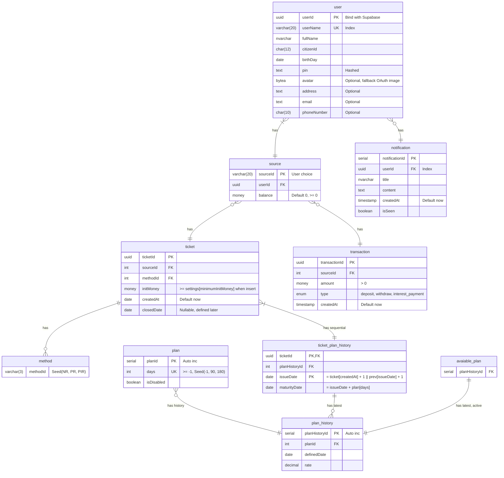
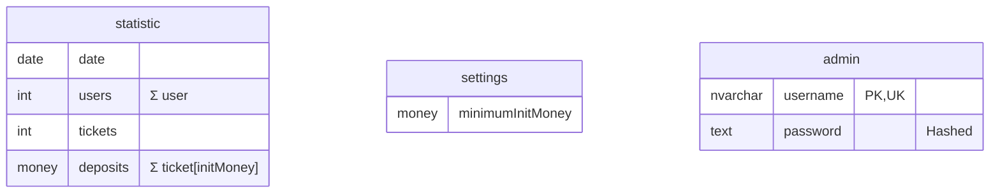

# Database

## Schemas

### User orientation

```mermaid
erDiagram
  user {
    uuid userId PK "Bind with Supabase"
    varchar(20) userName UK "Index"
    nvarchar fullName
    char(12) citizenId
    date birthDay
    text pin "Hashed"
    bytea avatar "Optional, fallback OAuth image"
    text address "Optional"
    text email "Optional"
    char(10) phoneNumber "Optional"
  }

  source {
    varchar(20) sourceId PK "User choice"
    uuid userId FK
    money balance "Default 0, >= 0"
  }

  method {
    %% Non-renewal, principal rollover, principal & interest rollover
    varchar(3) methodId "Seed(NR, PR, PIR)"
  }

  plan_history {
    serial planHistoryId PK "Auto inc"
    int planId FK
    date definedDate
    decimal rate
  }

  ticket {
    uuid ticketId PK
    int sourceId FK
    int methodId FK
    %% So what if I changed and there're other ... already, will be failed
    money initMoney ">= settings[minimumInitMoney] when insert"
    %% Calculate before return to client (not in DB)?
    date createdAt "Default now"
    date closedDate "Nullable, defined later"
  }

  ticket_plan_history {
    uuid ticketId PK,FK
    int planHistoryId FK
    date issueDate PK "= ticket[createdAt] + 1 || prev[issueDate] + 1"
    date maturityDate "= issueDate + plan[days]"
  }

  plan {
    serial planId PK "Auto inc"
    int days UK ">= -1, Seed(-1, 90, 180)"
    boolean isDisabled
  }

  avaiable_plan {
    serial planHistoryId FK
  }

  transaction {
    uuid transactionId PK
    int sourceId FK
    money amount "> 0"
    enum type "deposit, withdraw, interest_payment"
    timestamp createdAt "Default now"
  }

  notification {
    serial notificationId PK
    uuid userId FK "Index"
    nvarchar title
    text content
    timestamp createdAt "Default now"
    boolean isSeen
  }

  source }o--|| transaction : "has"
  user }o--|| notification : "has"
  user }|--|| source : "has"
  source }o--|| ticket : "has"
  ticket ||--o{ method : "has"
  ticket }|--|| ticket_plan_history : "has sequential"
  plan }o--|| plan_history : "has history"
  ticket_plan_history ||--}o plan_history : "has latest"
  avaiable_plan ||--|| plan_history : "has latest, active"
```

:::info[Materialized Views]

- `avaiable_plan`

:::

### Concretes

```mermaid
erDiagram
  statistic {
      date date
      int users "Σ user"
      int tickets
      money deposits "Σ ticket[initMoney]"
    }

    settings {
      money minimumInitMoney
    }

    admin {
      nvarchar username PK,UK
      text password "Hashed"
    }
```
