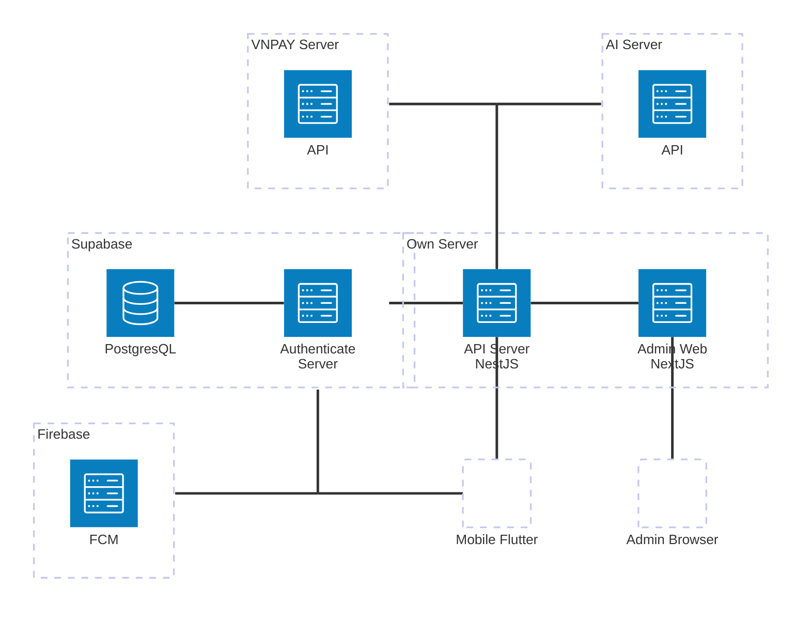

# Overall

## Diagram

```mermaid
architecture-beta
  group supabase[Supabase]
  service authentication_server(server)[Authenticate Server] in supabase
  service database(database)[PostgresQL] in supabase

  group own_server[Own Server]
  service api_server(server)[API Server NestJS] in own_server
  service admin_web_server(server)[Admin Web NextJS] in own_server

  group firebase[Firebase]
  service fcm(server)[FCM] in firebase

  group ai_server[AI Server]
  service api_ai(server)[API] in ai_server

  group vnpay_server[VNPAY Server]
  service vnpay_api(server)[API] in vnpay_server

  junction junction_bot_left

  junction api_server_and_ai_vnpay

  service mobile[Mobile Flutter]
  service admin[Admin Browser]

  api_server:L -- R:authentication_server{group}
  authentication_server:L -- R:database

  admin_web_server:L -- R:api_server

  fcm{group}:R -- L:junction_bot_left

  api_server:T -- B:api_server_and_ai_vnpay
  api_ai{group}:L -- R:api_server_and_ai_vnpay
  vnpay_api{group}:R -- L:api_server_and_ai_vnpay

  admin:T -- B:admin_web_server

  mobile:T -- B:api_server
  mobile:L -- R:junction_bot_left
  junction_bot_left:T -- B:authentication_server{group}
```

## Explanations

Hưng please
