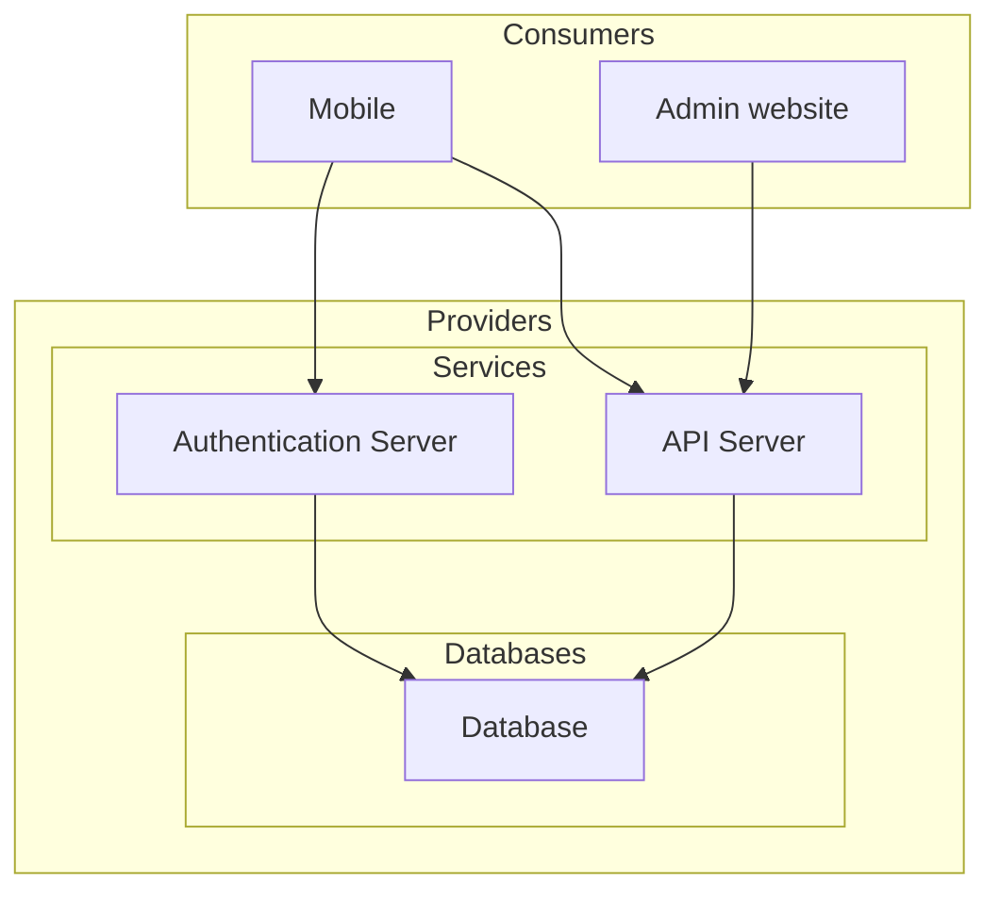

# Architecture

```mermaid
flowchart TD
  subgraph consumers["Consumers"]
    mobile["Mobile"]
    adminWebsite["Admin website"]
  end

  subgraph providers["Providers"]
    subgraph services["Services"]
      apiServer["API Server"]
      authenticationServer["Authentication Server"]
    end
    subgraph databases["Databases"]
      database["Database"]
    end
  end

  mobile-->authenticationServer
  mobile-->apiServer
  adminWebsite-->apiServer
  authenticationServer-->database
  apiServer-->database
```

:::info

This is SOA architecture

:::
