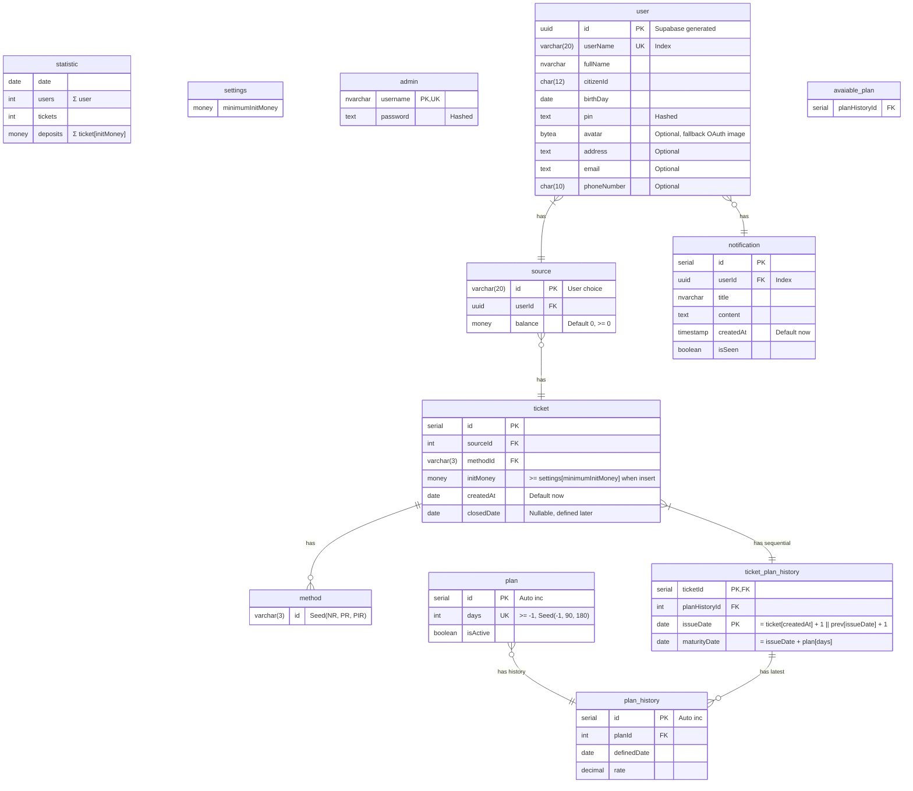

# Database

:::note

- Materialized view:
  - `avaiable_plan`: latest,active plan history

:::

## Term explanation

- **Method**:
  - `NR`: Non-rollover
  - `PR`: Principal Rollover
  - `PIR`: Principal & Interest Rollover
