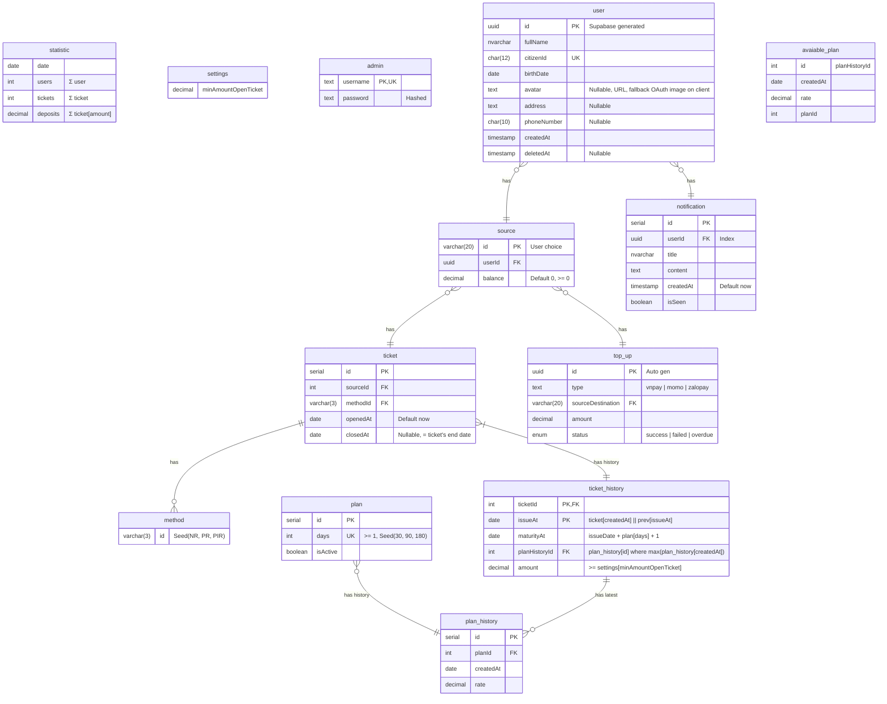

# Database

:::note

- `serial` type: It's `int` but auto increase. In other tables ref to the table has `serial` will have `int` type
- `decimal` type:

  - With money, it will be `decimal(12,0)`
  - With rate, it will be `decimal(4,2)`

- Materialized view:

  - `avaiable_plan`: latest,active plan history

:::

## Term explanation

- **Method**:
  - `NR`: Non-rollover
  - `PR`: Principal Rollover
  - `PIR`: Principal & Interest Rollover
