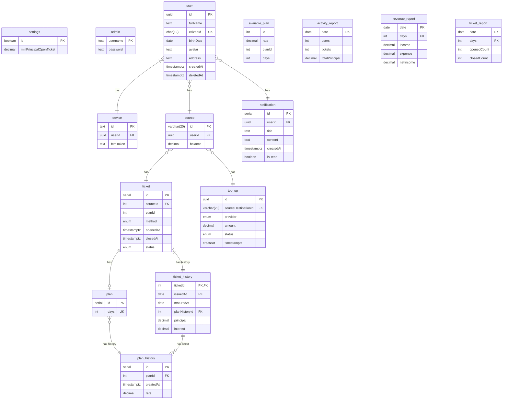

# Full database schema

```mermaid
erDiagram
  settings {
    boolean id PK
    decimal minPrincipalOpenTicket
  }

  admin {
    text username PK
    text password
  }

  user {
    uuid id PK
    text fullName
    char(12) citizenId UK
    date birthDate
    text avatar
    text address
    timestamptz createdAt
    timestamptz deletedAt
  }

  device {
    text id PK
    uuid userId FK
    text fcmToken
  }

  source {
    varchar(20) id PK
    uuid userId FK
    decimal balance
  }

  plan {
    serial id PK
    int days UK
  }

  plan_history {
    serial id PK
    int planId FK
    timestamptz createdAt
    decimal rate
  }

  ticket {
    serial id PK
    int sourceId FK
    int planId
    enum method
    timestamptz openedAt
    timestamptz closedAt
    enum status
  }

  ticket_history {
    int ticketId PK,FK
    date issuedAt PK
    date maturedAt
    int planHistoryId FK
    decimal principal
    decimal interest
  }

  notification {
    serial id PK
    uuid userId FK
    text title
    text content
    timestamptz createdAt
    boolean isRead
  }

  avaiable_plan {
    int id
    decimal rate
    int planId
    int days
  }

  top_up {
    uuid id PK
    varchar(20) sourceDestinationId FK
    enum provider
    decimal amount
    enum status
    createAt timestamptz
  }

  activity_report {
    date date PK
    int users
    int tickets
    decimal totalPrincipal
  }

  revenue_report {
    date date PK
    int days PK
    decimal income
    decimal expense
    decimal netIncome
  }

  ticket_report {
    date date PK
    int days PK
    int openedCount
    int closedCount
  }

  user }o--|| notification : "has"
  user }|--|| device : "has"
  user }o--|| source : "has"
  source }o--|| ticket : "has"
  source }o--|| top_up : "has"
  ticket }|--|| ticket_history : "has history"
  ticket ||--|o plan: "has"
  plan }o--|| plan_history : "has history"
  ticket_history ||--}o plan_history : "has latest"
```
