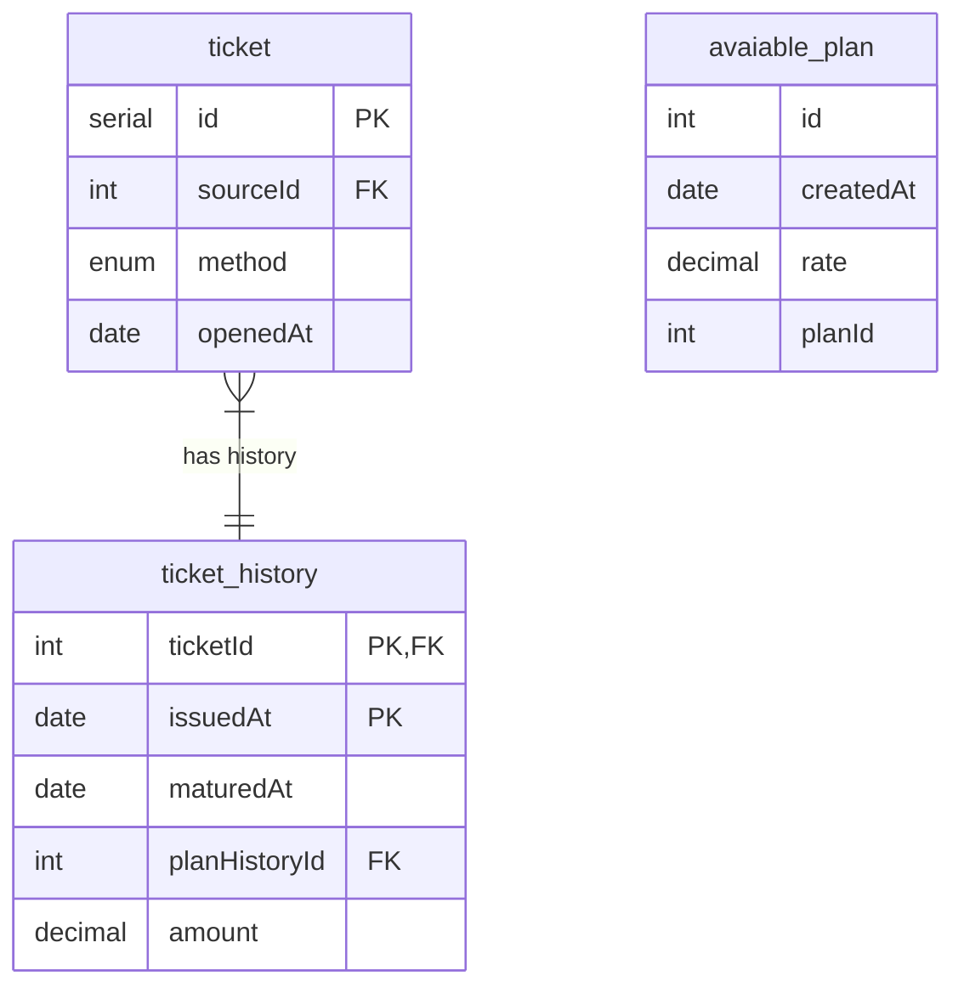
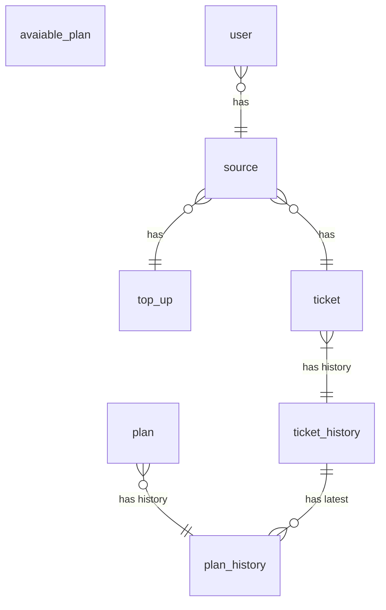
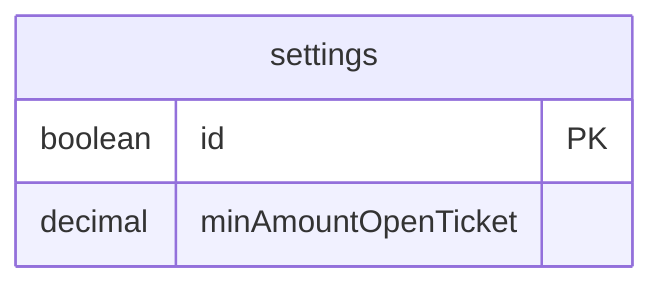
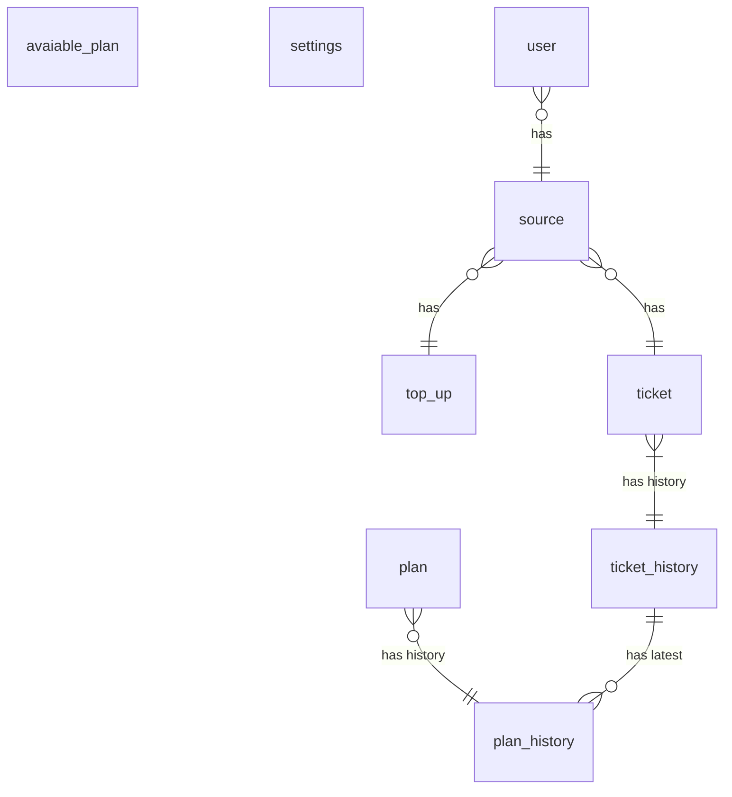

# Ticket creation

## Correctness

### New table(s)

```mermaid
erDiagram
  ticket {
    serial id PK
    int sourceId FK
    enum method
    date openedAt
  }

  ticket_history {
    int ticketId PK,FK
    date issuedAt PK
    date maturedAt
    int planHistoryId FK
    decimal amount
  }

  avaiable_plan {
    int id
    date createdAt
    decimal rate
    int planId
  }

  ticket }|--|| ticket_history : "has history"
```

### Full relationships

```mermaid
erDiagram
  avaiable_plan

  user }o--|| source : "has"
  source }o--|| top_up : "has"
  ticket }|--|| ticket_history : "has history"
  plan }o--|| plan_history : "has history"
  ticket_history ||--}o plan_history : "has latest"
  source }o--|| ticket : "has"
```

## Evolution

### New tables(s)

```mermaid
erDiagram
  settings {
    boolean id PK
    decimal minAmountOpenTicket
  }
```

### Full relationships

```mermaid
erDiagram
  avaiable_plan
  settings

  user }o--|| source : "has"
  source }o--|| top_up : "has"
  ticket }|--|| ticket_history : "has history"
  plan }o--|| plan_history : "has history"
  ticket_history ||--}o plan_history : "has latest"
  source }o--|| ticket : "has"
```
