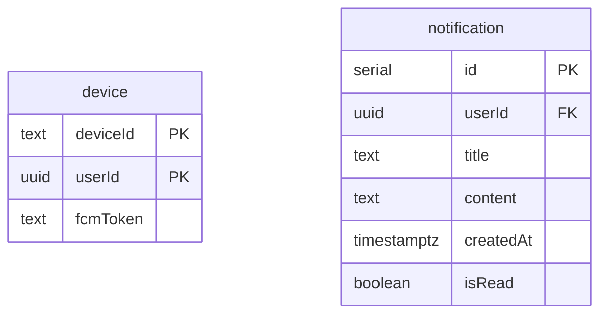
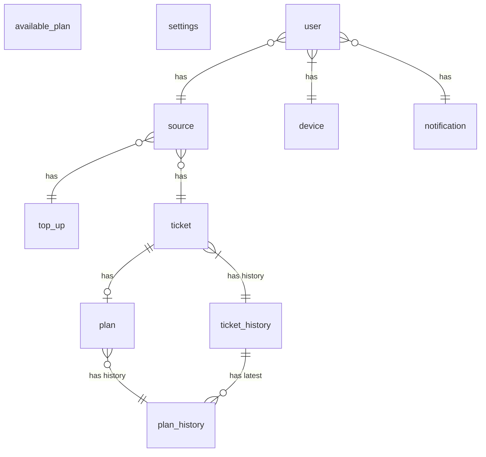

# Ticket withdrawn and maturation

:::note

I don't think maturation is a right word to describe what I want...?

:::

## Correctness

### New table(s)

```mermaid
erDiagram
  device {
    text deviceId PK
    uuid userId PK
    text fcmToken
  }

  notification {
    serial id PK
    uuid userId FK
    text title
    text content
    timestamptz createdAt
    boolean isRead
  }
```

### Full relationships

```mermaid
erDiagram
  available_plan
  settings

  user }o--|| source : "has"
  user }|--|| device : "has"
  user }o--|| notification : "has"
  source }o--|| top_up : "has"
  plan }o--|| plan_history : "has history"
  ticket }|--|| ticket_history : "has history"
  ticket ||--|o plan: "has"
  ticket_history ||--}o plan_history : "has latest"
  source }o--|| ticket : "has"
```
