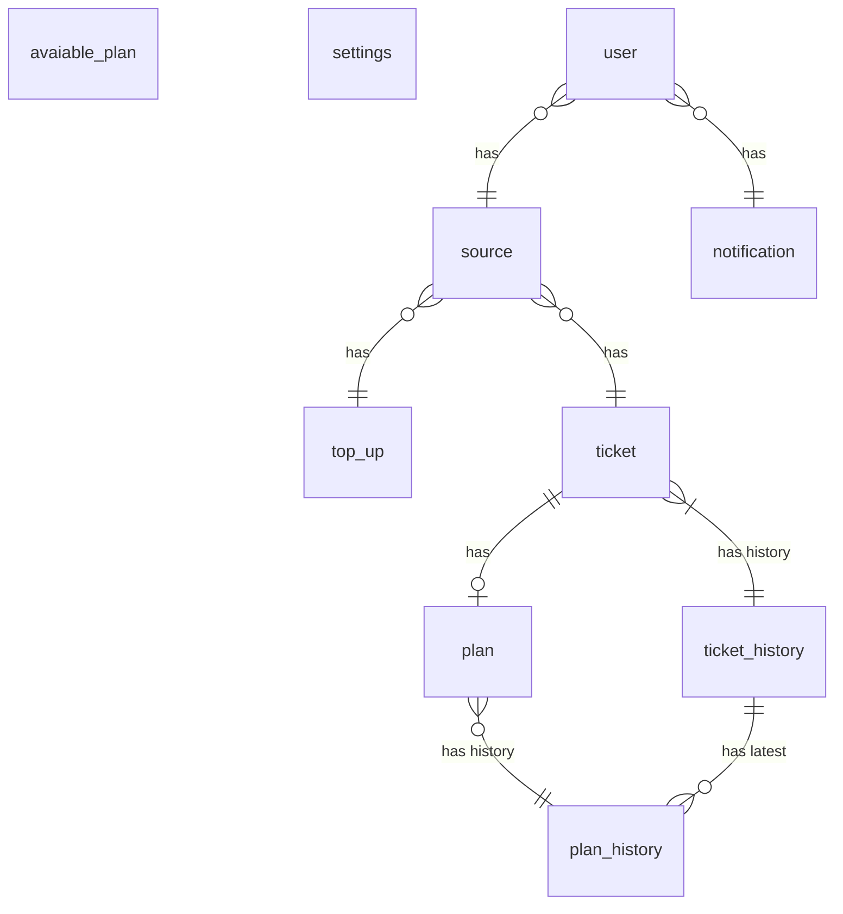

# Ticket withdrawn and maturation

::: note

I don't think maturation is a right word to describe what I want...?

:::

## Correctness

### New table(s)

```
erDiagram
  notification {
    serial id PK
    uuid userId FK
    nvarchar title
    text content
    timestamptz createdAt
    boolean isRead
  }
```
### Full relationships


