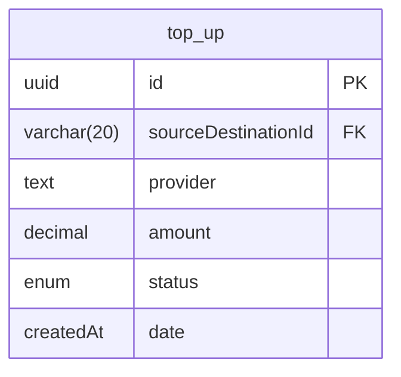
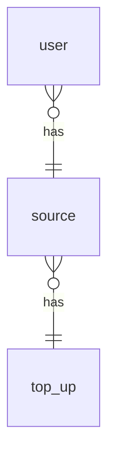

<!-- START doctoc generated TOC please keep comment here to allow auto update -->
<!-- DON'T EDIT THIS SECTION, INSTEAD RE-RUN doctoc TO UPDATE -->
**Table of Contents**  *generated with [DocToc](https://github.com/thlorenz/doctoc)*

- [Top up](#top-up)
  - [Correctness](#correctness)
    - [New table](#new-table)
    - [Full relationships](#full-relationships)

<!-- END doctoc generated TOC please keep comment here to allow auto update -->

---
sidebar_position: 3
---

# Top up

## Correctness

### New table

### Full relationships

