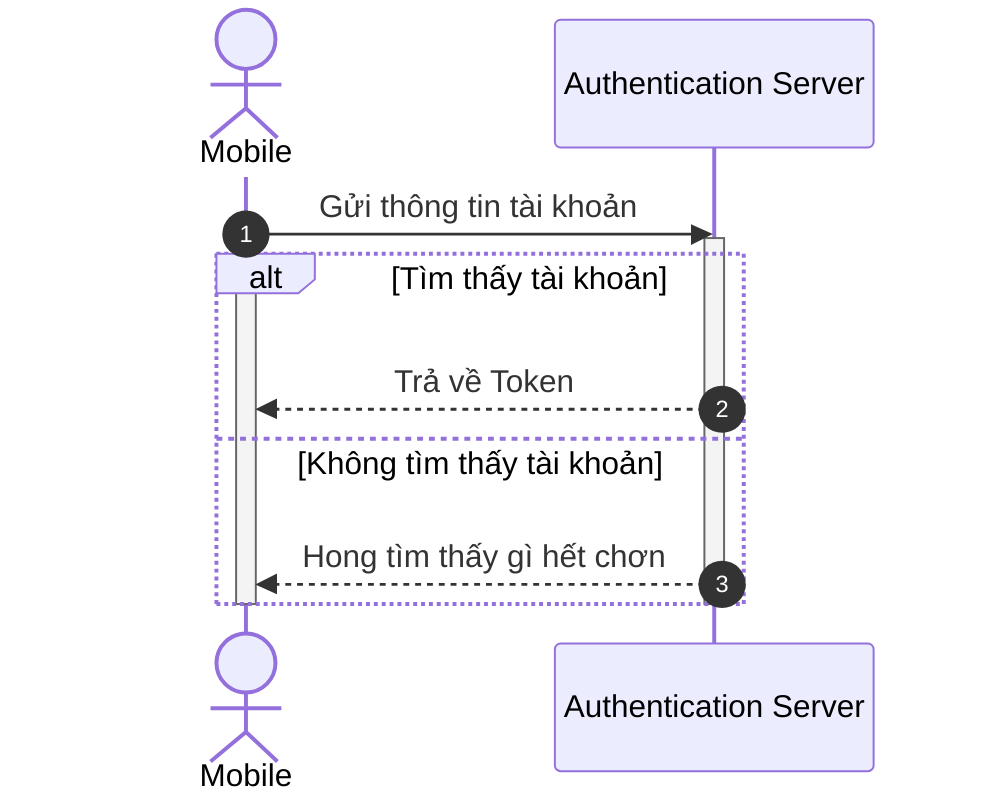
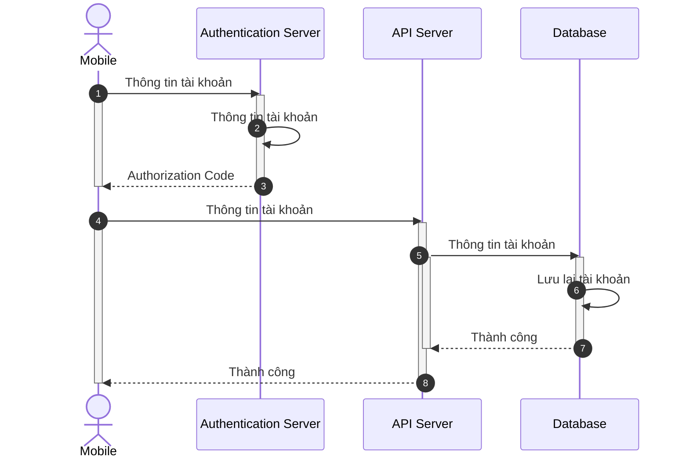
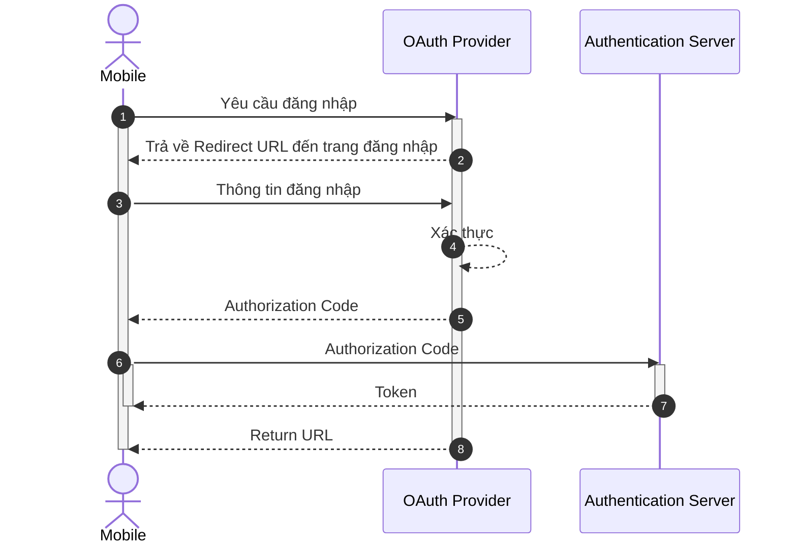

# User authentication

## Credentials

### Login

```mermaid
sequenceDiagram
  autonumber
  actor mobile as Mobile
  participant authServer as Authentication Server

  mobile->>authServer: Gửi thông tin tài khoản
  activate mobile
  activate authServer
  alt Tìm thấy tài khoản
    authServer-->>mobile: Trả về Token
  else Không tìm thấy tài khoản
    authServer-->>mobile: Hong tìm thấy gì hết chơn
  end
  deactivate mobile
  deactivate authServer
```

### Register

```mermaid
sequenceDiagram
  autonumber
  actor mobile as Mobile
  participant authServer as Authentication Server
  participant apiServer as API Server
  participant db as Database

  mobile->>authServer: Thông tin tài khoản
  activate mobile
  activate authServer
  authServer->>authServer: Thông tin tài khoản
  authServer-->>mobile: Authorization Code
  deactivate mobile
  deactivate authServer
  mobile->>apiServer: Thông tin tài khoản
  activate mobile
  activate apiServer
  apiServer->>db: Thông tin tài khoản
  activate apiServer
  activate db
  db->>db: Lưu lại tài khoản
  db-->>apiServer: Thành công
  deactivate apiServer
  deactivate db
  apiServer-->>mobile: Thành công
  deactivate mobile
  deactivate apiServer
```

## OAuth

```mermaid
sequenceDiagram
  autonumber
  actor mobile as Mobile
  participant OAuthProvider as OAuth Provider
  participant authServer as Authentication Server

  mobile->>OAuthProvider: Yêu cầu đăng nhập
  activate mobile
  activate OAuthProvider
  OAuthProvider-->>mobile: Trả về Redirect URL đến trang đăng nhập
  mobile->>OAuthProvider: Thông tin đăng nhập
  OAuthProvider-->>OAuthProvider: Xác thực
  OAuthProvider-->>mobile: Authorization Code
  mobile->>authServer: Authorization Code
  activate mobile
  activate authServer
  authServer-->>mobile: Token
  deactivate mobile
  deactivate authServer
  OAuthProvider-->>mobile: Return URL
  deactivate mobile
  deactivate OAuthProvider

```
