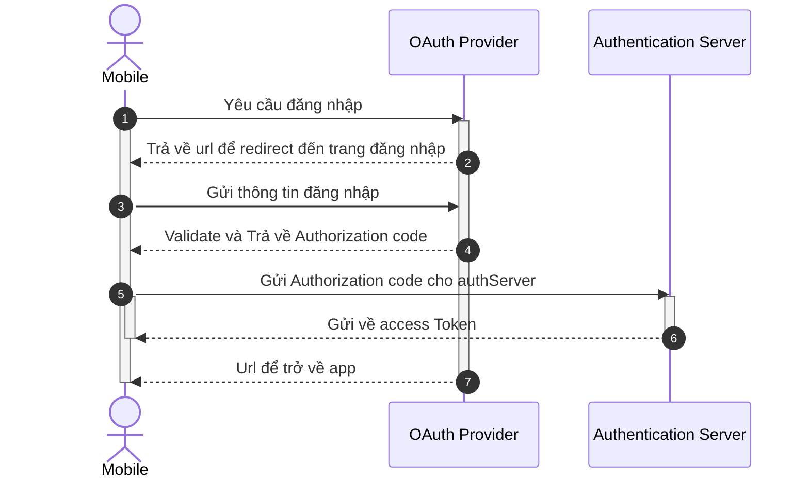

- ## sidebar_position: 1

# User authentication

## Credentials

```mermaid
sequenceDiagram
  autonumber
  actor mobile as Mobile
  participant authServer as Authentication Server

  mobile->>authServer: Gửi thông tin tài khoản
  activate mobile
  activate authServer
  alt Tìm thấy tài khoản
    authServer-->>mobile: Trả về JWT
  else Không tìm thấy tài khoản
    authServer-->>mobile: Hong tìm thấy gì hết chơn
  end
  deactivate mobile
  deactivate authServer
```

## OauthApp

```mermaid
sequenceDiagram
  autonumber
  actor mobile as Mobile
  participant OAuthProvider as OAuth Provider
  participant authServer as Authentication Server

  mobile->>OAuthProvider: Yêu cầu đăng nhập
  activate mobile
  activate OAuthProvider
  OAuthProvider-->>mobile: Trả về url để redirect đến trang đăng nhập
  mobile->>OAuthProvider: Gửi thông tin đăng nhập
  OAuthProvider-->>mobile: Validate và Trả về Authorization code
  mobile->>authServer: Gửi Authorization code cho authServer
  activate mobile
  activate authServer
  authServer-->>mobile: Gửi về access Token
  deactivate mobile
  deactivate authServer
  OAuthProvider-->>mobile: Url để trở về app
  deactivate mobile
  deactivate OAuthProvider

```
