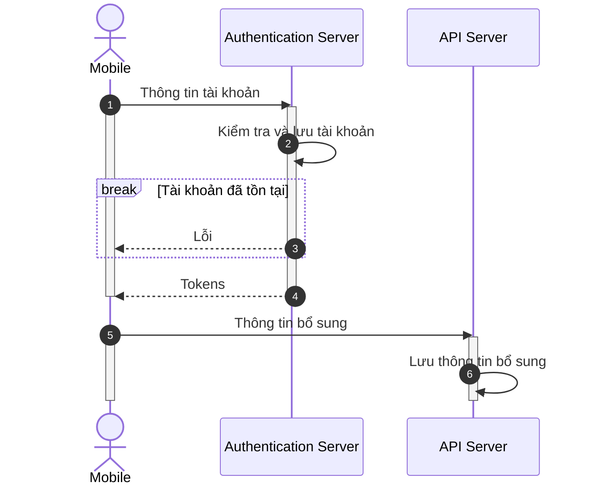
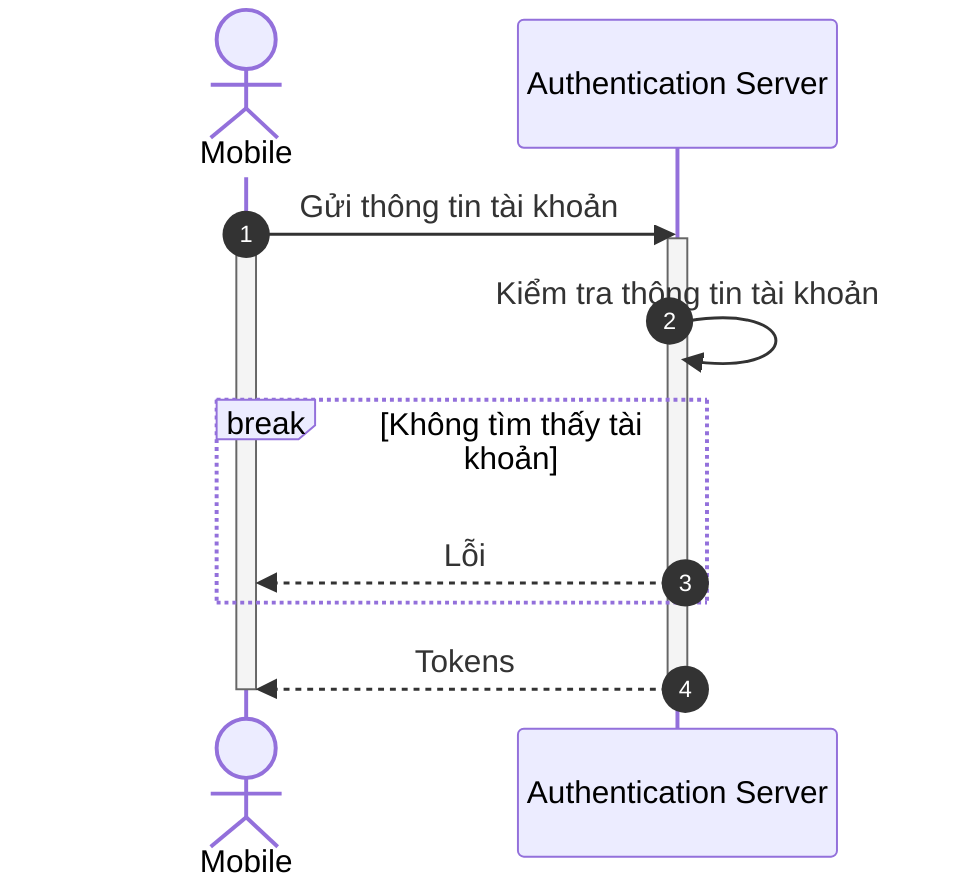
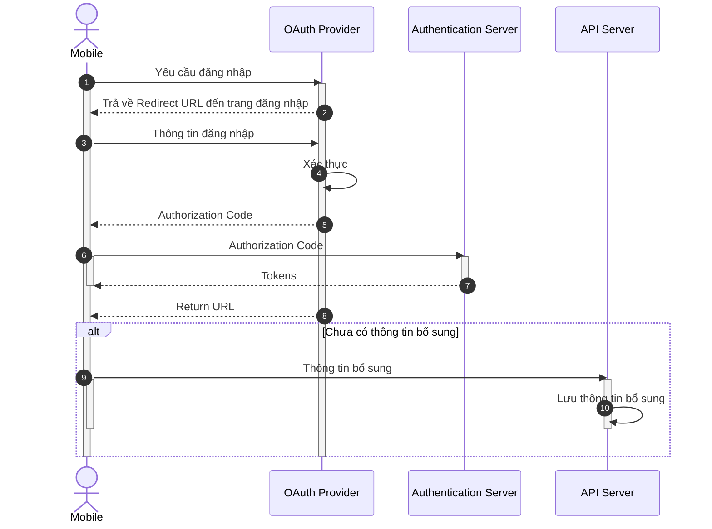

# User authentication

## Credentials

### Register

```mermaid
sequenceDiagram
  autonumber
  actor mobile as Mobile
  participant authServer as Authentication Server
  participant apiServer as API Server

  mobile->>authServer: Thông tin tài khoản
  activate mobile
  activate authServer
  authServer->>authServer: Kiểm tra và lưu tài khoản
  break Tài khoản đã tồn tại
    authServer-->>mobile: Lỗi
  end
  authServer-->>mobile: Tokens
  deactivate mobile
  deactivate authServer
  mobile->>apiServer: Thông tin bổ sung
  activate mobile
  activate apiServer
  apiServer->>apiServer: Lưu thông tin bổ sung
  deactivate mobile
  deactivate apiServer
```

### Login

```mermaid
sequenceDiagram
  autonumber
  actor mobile as Mobile
  participant authServer as Authentication Server

  mobile->>authServer: Gửi thông tin tài khoản
  activate mobile
  activate authServer
  authServer->>authServer: Kiểm tra thông tin tài khoản
  break Không tìm thấy tài khoản
    authServer-->>mobile: Lỗi
  end
    authServer-->>mobile: Tokens
  deactivate mobile
  deactivate authServer
```

## OAuth

```mermaid
sequenceDiagram
  autonumber
  actor mobile as Mobile
  participant OAuthProvider as OAuth Provider
  participant authServer as Authentication Server
  participant apiServer as API Server

  mobile->>OAuthProvider: Yêu cầu đăng nhập
  activate mobile
  activate OAuthProvider
  OAuthProvider-->>mobile: Trả về Redirect URL đến trang đăng nhập
  mobile->>OAuthProvider: Thông tin đăng nhập
  OAuthProvider->>OAuthProvider: Xác thực
  OAuthProvider-->>mobile: Authorization Code
  mobile->>authServer: Authorization Code
  activate mobile
  activate authServer
  authServer-->>mobile: Tokens
  deactivate mobile
  deactivate authServer
  OAuthProvider-->>mobile: Return URL
  alt Chưa có thông tin bổ sung
    mobile->>apiServer: Thông tin bổ sung
    activate mobile
    activate apiServer
    apiServer->>apiServer: Lưu thông tin bổ sung
    deactivate mobile
    deactivate apiServer
  end
  deactivate mobile
  deactivate OAuthProvider
```
