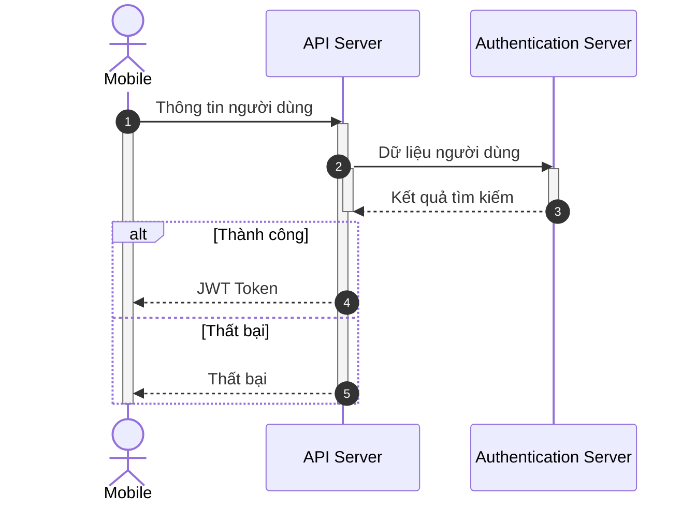
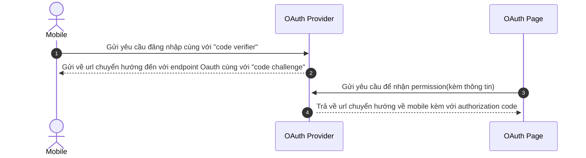

# User authentication

## Credentials

```mermaid
sequenceDiagram
  autonumber
  actor mobile as Mobile
  participant apiServer as API Server
  participant authServer as Authentication Server

  mobile->>apiServer: Thông tin người dùng
  activate mobile
  activate apiServer
  apiServer->>authServer: Dữ liệu người dùng
  activate apiServer
  activate authServer
  authServer-->>apiServer: Kết quả tìm kiếm
  deactivate apiServer
  deactivate authServer
  alt Thành công
    apiServer-->>mobile: JWT Token
  else Thất bại
    apiServer-->>mobile: Thất bại
  end
  deactivate mobile
  deactivate apiServer
```

## Oauth

```mermaid
sequenceDiagram
  autonumber
  actor mobile as Mobile
  participant oauthProvider as OAuth Provider
  participant oauthPage as OAuth Page

  mobile->>oauthProvider: Gửi yêu cầu đăng nhập cùng với "code verifier"
  activate mobile
  activate oauthProvider
  oauthProvider-->>mobile: Gửi về url chuyển hướng đến với endpoint Oauth cùng với "code challenge"

  oauthPage->>oauthProvider: Gửi yêu cầu để nhận permission(kèm thông tin)
  activate oauthProvider
  activate oauthPage
  oauthProvider-->>oauthPage: Trả về url chuyển hướng về mobile kèm với authorization code
```
